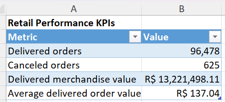
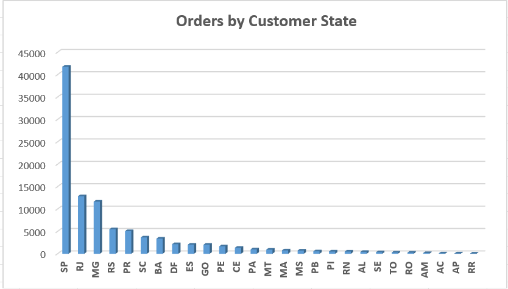
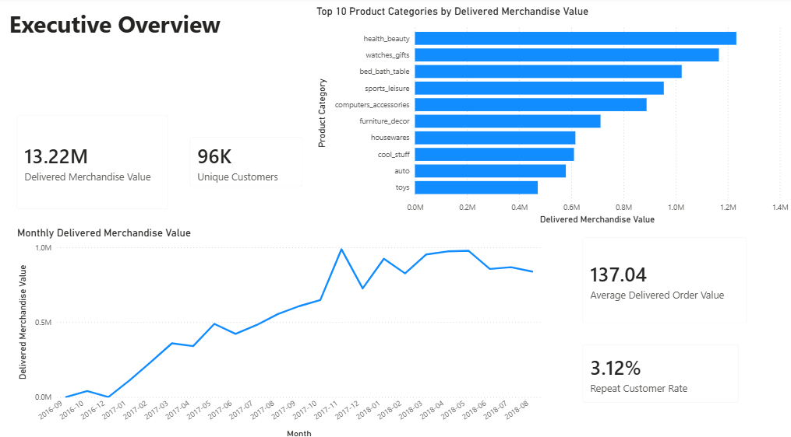
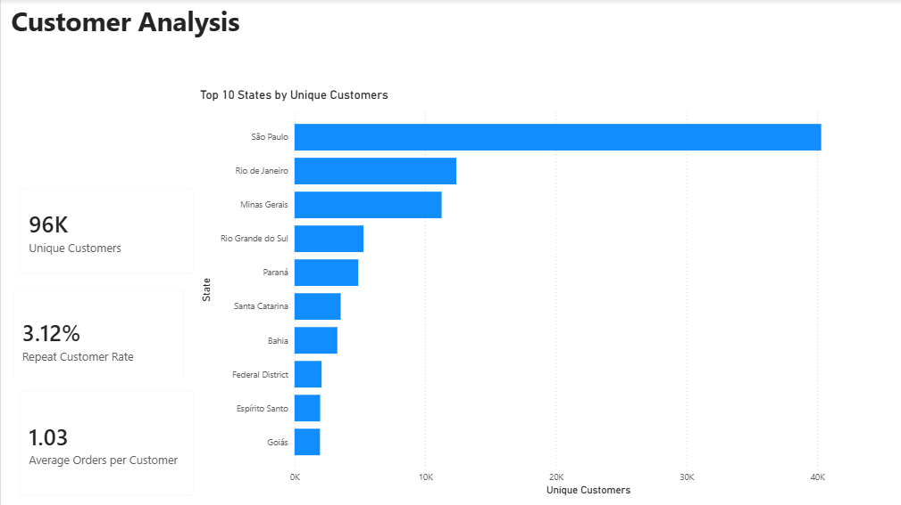
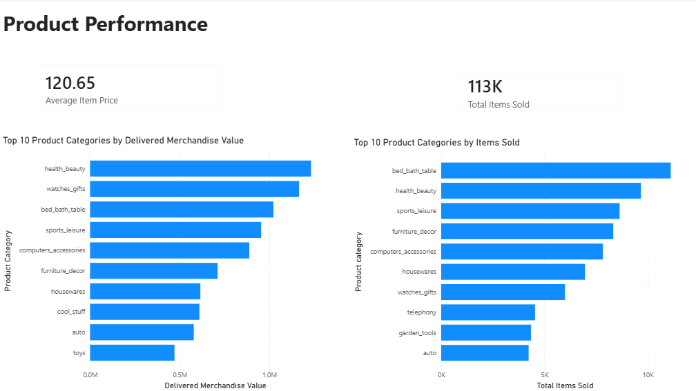

# Retail & Customer Analytics with SQL, Excel, Python and Power BI

I built this project using the Olist Brazilian e-commerce dataset to understand how the business performed across orders, customers, products and regions.

I used SQL for querying and data-quality checks, Python for cleaning and exploratory analysis, Excel for KPI calculations and pivot-based analysis, and Power BI for the final dashboard.

The project answers practical business questions such as:

- How many orders were successfully delivered?
- How much merchandise value was generated?
- Which months performed best or worst?
- Which product categories contributed the most value?
- Where are most customers located?
- How many customers returned to place another order?

## Tools Used

- PostgreSQL and pgAdmin
- SQL
- Python
- pandas
- Matplotlib
- Excel
- Power BI
- DAX

## What I Completed

- Created and loaded the main Olist tables into PostgreSQL
- Performed SQL data-quality checks and business analysis
- Cleaned and validated the data in Python
- Analysed monthly performance, customer behaviour, product categories and geography
- Used Excel for XLOOKUP, COUNTIFS, SUMIFS, PivotTables and PivotCharts
- Built a Power BI data model and created DAX measures
- Created three Power BI pages:
  - Executive Overview
  - Customer Analysis
  - Product Performance

## Project Status

The project is complete. The final workflow includes PostgreSQL and SQL analysis, Python-based data validation and exploratory analysis, Excel-based KPI and pivot analysis, and a three-page Power BI dashboard covering overall business performance, customer behaviour and product performance.

## Key Findings

- The dataset contains 96,478 delivered orders.
- Delivered merchandise value was approximately R$13.22 million.
- Average delivered order value was approximately R$137.04.
- November 2017 was the strongest month, generating R$987,765.37 in delivered merchandise value.
- The largest month-on-month increase occurred in February 2017 at approximately 109.5%.
- The largest month-on-month decrease occurred in December 2017 at approximately 26.5%.
- Only 2,997 customers placed more than one order, resulting in a repeat-purchase rate of approximately 3.12%.
- São Paulo had the largest customer base, followed by Rio de Janeiro and Minas Gerais.
- The highest-value product categories included health and beauty, watches and gifts, bed, bath and table, sports and leisure, and computer accessories.
- The data-quality checks identified missing product categories and a small number of delivered orders with missing delivery dates.

## Business Recommendations

- Customer retention should be a priority because only a small percentage of customers placed more than one order. Loyalty rewards, personalised offers and follow-up promotions could help encourage repeat purchases.
- São Paulo is the largest customer market, so marketing, delivery performance and customer service should receive particular attention in that region.
- High-value product categories should be monitored closely because they contribute a large share of merchandise value.
- The strong performance in November 2017 could be investigated further to determine whether it was driven by promotions, seasonal demand or particular product categories.
- The decline in December 2017 should be reviewed alongside seasonality, stock availability and delivery performance.
- Missing product categories and delivery dates should continue to be monitored because data-quality issues can affect reporting accuracy.

## Excel Analysis

### KPI Summary

### Orders by Customer State

## Power BI Dashboard

### Executive Overview

### Customer Analysis

### Product Performance

## Repository Structure

- `SQL/` — database setup, data-quality checks and business analysis queries
- `notebooks/` — Python data validation and exploratory analysis
- `figures/` — screenshots of the Power BI dashboard pages
- `docs/` — data dictionary
- `data/` — dataset information and source attribution

## Dataset and Working Files

The analysis uses the [Olist Brazilian E-Commerce Public Dataset](https://www.kaggle.com/datasets/olistbr/brazilian-ecommerce), published by Olist under the [CC BY-NC-SA 4.0 licence](https://creativecommons.org/licenses/by-nc-sa/4.0/).

This is a personal, non-commercial portfolio project. The original CSV files are not included. The Excel and Power BI working files are also excluded because they contain embedded copies of the source data. Dashboard screenshots are provided above.
